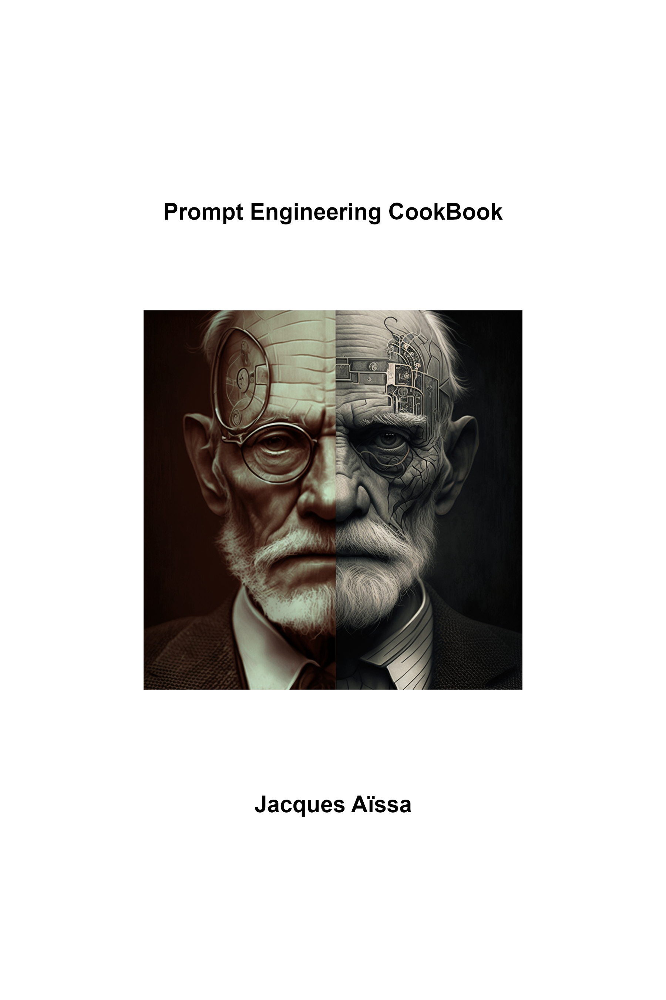

# Prompt Engineering Cookbook

How to become an AI PSY

This book has diffrent parts and chapters that you can follow but I recommand to read the book in this order :

* ChatGPT
  * forewords : Important people talking about this book, maybe you ?
  * preface
  * [intro : Introduction](intro.md)
  * [chapter 1 : What is the content of a prompt](chap1.md)
  * [chapter 2 : How to write a story](chap2.md)
  * [chapter 3 : Reverse prompt](chap3.md)
  * chapter 4
  * chapter 5
  * ...
  * [references](refs.md)
* MidJourney

### license & copyright

The original **Prompt Engineering Cookbook** is licensed under a [Creative Commons Attribution-ShareAlike 3.0 Unported License][license]. You are free:

* to Share—to copy, distribute and transmit the work
* to Remix—to adapt the work
* to make commercial use of the work

Read the [license](https://creativecommons.org/licenses/by-sa/3.0/deed.fr) yourself. The bottom line is, it’s free, *free*, **FREE**! And don’t just take my word for it, this repository contains the markdown source for the entire book.

### The "First" Edition

[pc1]: https://leanpub.com/prompt-engineering-cookbook

## q & a

### I don't want to pay to download a PDF. Can I make my own?

Yes, you can use the markdown source in this repository to make your own PDF. Or any other format.

### Great book! Can I still buy it?

Not from me! Instead, [please fix a price](https://leanpub.com/prompt-engineering-cookbook).

### I don't want to buy it, but I'd like to say "thank you" with a tip.

Sure thing, you can send a donation via tipeee to help me write:

### I'd like to share it.

And I'd also like you to share it, in this form, in PDF, or anything else. Go wild, just follow the attribution rules in the [license].

### Hey, I have a great way to make money with this.

Go for it, you are free to make commercial use of the work. For example, you could host it on your site and make money from ads, or write a JS tool and use the book as part of the help content. It's all good, just follow the [license terms][license]. 

### I found a typo/error!

This book is actively maintained. Please just, open an issue. Thanks!

[license]: https://creativecommons.org/licenses/by-sa/3.0/deed.fr "Creative Commons Attribution-ShareAlike 3.0 Unported License"

